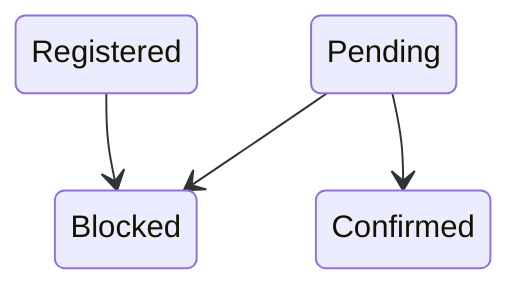
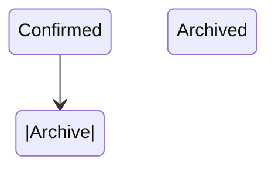
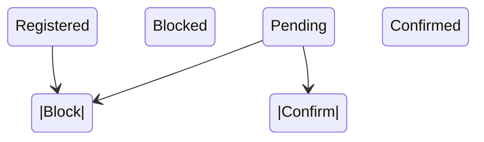

# StateChart Generator

`StateChart` is a command-line tool that scans Go projects for interfaces named `XStateMachine` (e.g., `OrderStateMachine`), parses their state transition definitions, and generates **Mermaid.js** diagrams to visualize state transitions.

## Features

- **Automatic Interface Detection**: Finds all interfaces named `XStateMachine` in `.go` files across your project.
- **Mermaid.js Output**: Generates `stateDiagram-v2` diagrams compatible with tools like GitHub, Notion, and VSCode.
- **Handles Inline Comments**: Extracts transition definitions from method comments.
- **Multi-File Support**: Processes multiple files and generates diagrams for each `XStateMachine` interface.
- **Customizable Output**: Save generated diagrams to a specified directory.

---

## Installation

Ensure you have Go installed, then install the tool:

```bash
go install github.com/yourusername/statechart/cmd@latest
```

---

## Usage

### Generate a Diagram for a Single File

To generate a Mermaid.js diagram from a single Go file:

```bash
statechart generate --file path/to/file.go --output path/to/output/file.mmd
```

- `--file`: Path to the Go file to process.
- `--output`: Path to save the Mermaid.js diagram (optional).

### Scan an Entire Project

To scan a project for all `XStateMachine` interfaces and generate diagrams:

```bash
statechart scan --project path/to/project --output path/to/output/directory
```

- `--project`: Path to the root directory of your project (default: current directory).
- `--output`: Directory to save the generated Mermaid diagrams (default: `./charts`).

---

## Example

### Input File: `order.go`

```go
package order

const (
	StatePending   = "Pending"
	StateConfirmed = "Confirmed"
	StateBlocked   = "Blocked"
)

// Pending, Registered -> Blocked
type OrderStateMachine interface {
	Block() error // Pending, Registered -> Blocked
	Confirm() error // Pending -> Confirmed
}

// Confirmed -> Archived
type ArchiveStateMachine interface {
	Archive() error // Confirmed -> Archived
}
```

### Generated Diagrams

#### `charts/orderstatemachine.mmd`



#### `charts/archivestatemachine.mmd`



---

## Output Directory Structure

For a project with multiple `XStateMachine` interfaces across files, the output directory will look like:

```
charts/
├── orderstatemachine.mmd
├── archivestatemachine.mmd
└── userstatemachine.mmd
```

---

## Mermaid.js Integration

Mermaid.js diagrams can be embedded into Markdown files for documentation:

```markdown

```

Use this in tools like GitHub, Notion, or VSCode to visualize the diagrams.

---

## Development

### Clone the Repository

```bash
git clone https://github.com/yourusername/statechart.git
cd statechart
```

### Run Locally

```bash
go run cmd/statechart.go scan --project /path/to/project --output ./charts
```

### Build the Tool

```bash
go build -o statechart cmd/statechart.go
```

---

## Contributing

Contributions are welcome! Here’s how you can help:

1. Fork the repository.
2. Create a feature branch: `git checkout -b feature-name`.
3. Commit your changes: `git commit -m "Add feature"`.
4. Push to your branch: `git push origin feature-name`.
5. Open a pull request.

---

## License

This project is licensed under the MIT License. See the [LICENSE](LICENSE) file for details.

---

## Feedback and Support

If you have questions or suggestions, feel free to open an issue or contact [yourusername](https://github.com/yourusername).

--- 

This updated `README.md` provides detailed usage instructions, updated examples, and reflects the new functionality of scanning all `.go` files for `XStateMachine` interfaces. 🚀