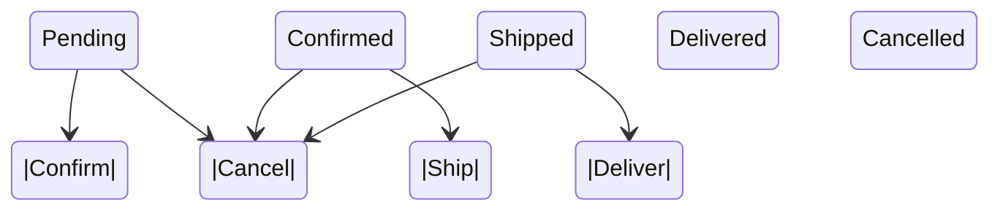

Here's a `README.md` for your project:

---

# StateChart Generator

`StateChart` is a command-line tool that scans a Go project for `_state_machine.go` files, parses state machine definitions, and generates **Mermaid.js** diagrams to visually represent the state transitions.

## Features

- **Automatic Scanning**: Finds all `_state_machine.go` files in the specified project directory.
- **Mermaid.js Output**: Generates `stateDiagram-v2` charts, compatible with tools like GitHub, Notion, and VSCode.
- **Customizable Output**: Save generated charts to a specific directory.
- **Lightweight**: Easily integrates into your documentation or CI/CD pipeline.

---

## Installation

Ensure you have Go installed, then install the tool using:

```bash
go install github.com/chalfel/statechart@latest
```

---

## Usage

### Scan an Entire Project

To scan a project for all `_state_machine.go` files and generate Mermaid.js diagrams:

```bash
statechart -project /path/to/project -output /path/to/output/charts
```

- `-project`: Path to the root of your project (default is the current directory).
- `-output`: Path to save the generated Mermaid charts (default is `./charts`).

---

## Example

### Input: `_state_machine.go` File

```go
package order

type OrderState string

const (
	StatePending   OrderState = "Pending"
	StateConfirmed OrderState = "Confirmed"
	StateShipped   OrderState = "Shipped"
	StateDelivered OrderState = "Delivered"
)

type OrderStateMachine interface {
	Confirm() error   // Pending -> Confirmed
	Ship() error      // Confirmed -> Shipped
	Deliver() error   // Shipped -> Delivered
	Cancel() error    // Pending, Confirmed, Shipped -> Cancelled
}
```

### Output: Mermaid.js Diagram

The tool generates the following diagram:



Saved as `charts/order_state_machine.go.mmd`.

---

## Integrate into CI/CD

You can use the tool in your CI/CD pipeline to automatically generate state diagrams:

```bash
statechart -project . -output ./charts
```

---

## Development

### Clone the Repository

```bash
git clone https://github.com/chalfel/statechart.git
cd statechart
```

### Run Locally

```bash
go run main.go -project /path/to/project -output /path/to/output/charts
```

### Build the Tool

```bash
go build -o statechart main.go
```

---

## Contributing

1. Fork the repository.
2. Create a feature branch: `git checkout -b feature-name`.
3. Commit your changes: `git commit -m "Add feature"`.
4. Push to the branch: `git push origin feature-name`.
5. Open a pull request.

---

## License

This project is licensed under the MIT License. See the [LICENSE](LICENSE) file for details.

---

## Feedback and Support

If you have questions or suggestions, feel free to open an issue or contact [chalfel](https://github.com/chalfel).

--- 

This `README.md` should provide a clear understanding of the tool's purpose, usage, and contribution guidelines. 🚀